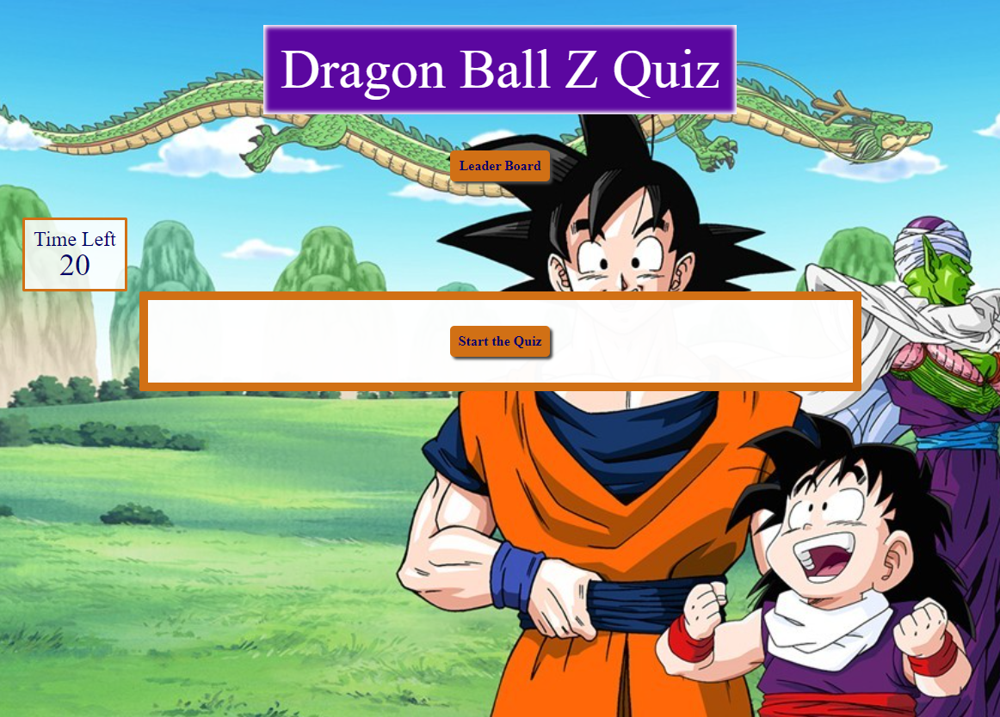

# Code-Quiz

## Summary
  I made a quiz about the popular anime show Dragon Ball Z.  This is a timed quiz that calculates your power level. You get bonus points for finishing with time left on the clock but be careful because each wrong answer removes time from the clock. 

  I used local storage to keep track of the power levels of players, and DOM manipulation to dynamically render each question.  

## Screenshot

## Links to page
[Deployed page](https://cygnet717.github.io/Code-Quiz/)

[Repo](https://github.com/Cygnet717/Code-Quiz)
